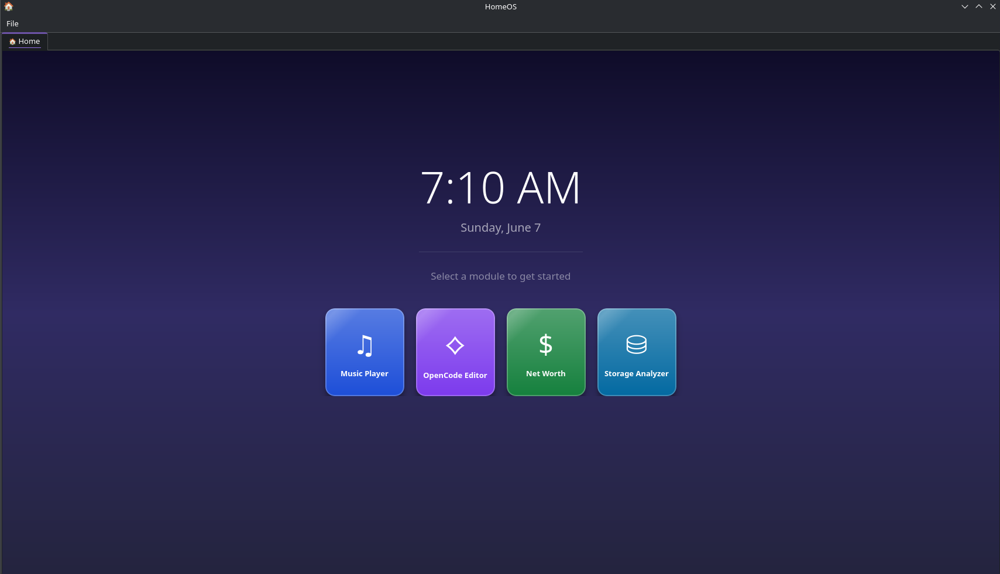
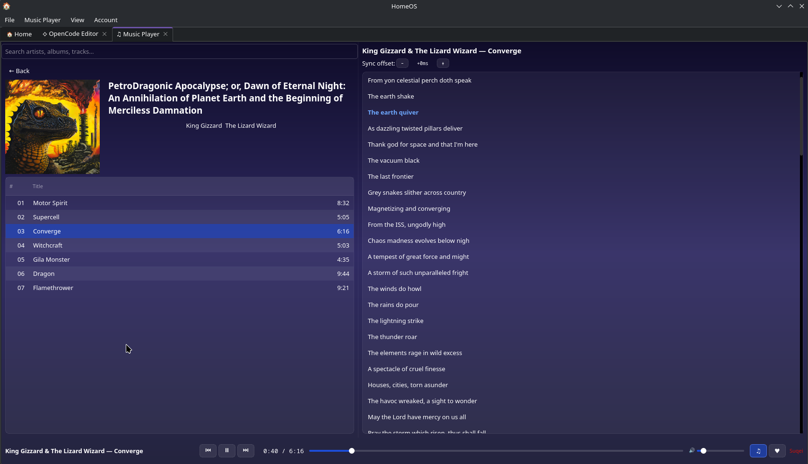
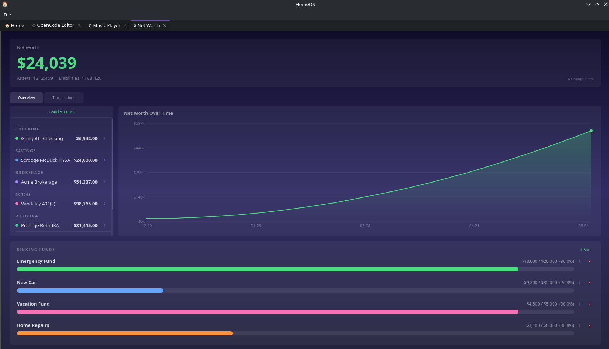
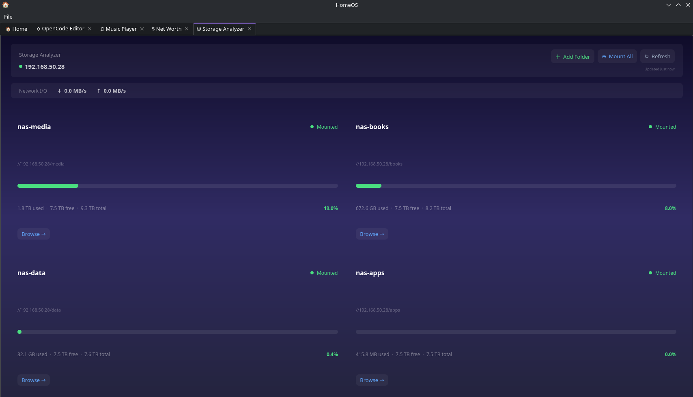
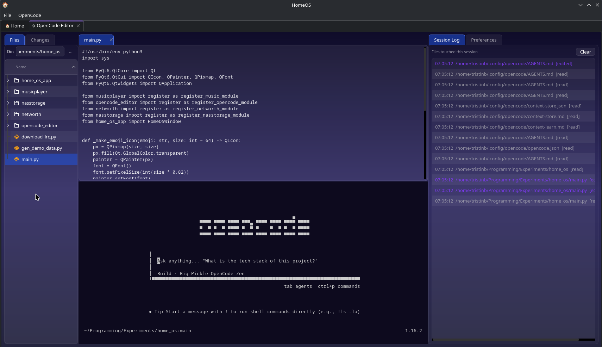

# HomeOS

HomeOS is a personal desktop dashboard built with PyQt6. It puts a music player, a net worth tracker, a storage analyzer, and an OpenCode editor interface all in one place, wrapped in a consistent dark UI.

It is designed around the idea that your personal tools should live together instead of being scattered across browser tabs and terminal windows. Everything runs locally.



---

## Modules

**Music Player** scans a local folder for audio files, plays them with a queue and shuffle, shows synced lyrics, and scrobbles to Last.fm if you connect an account.



**Net Worth Tracker** tracks your accounts, transactions, and sinking funds. You can enter everything manually inside the app, or if you use the LifeOS Android app, you can sync directly from a USB-connected phone over ADB.



**Storage Analyzer** shows disk usage for any folder on your machine. Add as many folders as you want and browse their contents. If you have network shares configured in `/etc/fstab`, those are detected automatically and you can mount them from inside the app.



**OpenCode Editor** is a GUI wrapper around [opencode](https://github.com/sst/opencode). It gives you a file tree, an editor, a terminal, a session log, and a git changes panel, all pointing at whatever project you have open. OpenCode must already be installed and on your PATH for this module to work.



---

## Requirements

### System dependencies

- Python 3.10 or newer
- `pip`
- `adb` (Android Debug Bridge) if you want the LifeOS sync feature in the Net Worth module. On Arch: `sudo pacman -S android-tools`. On Ubuntu/Debian: `sudo apt install adb`.
- `opencode` if you want the OpenCode Editor module. Install it with `npm install -g opencode` or follow the instructions at the [opencode repo](https://github.com/sst/opencode). After installing, confirm it works by running `opencode --version` in a terminal.

### Python packages

```
PyQt6
PyQt6-WebEngine
psutil
mutagen
requests
```

---

## Installation

Clone the repository and install the dependencies:

```bash
git clone <your-repo-url> home_os
cd home_os
pip install PyQt6 PyQt6-WebEngine psutil mutagen requests
```

Then run it:

```bash
python main.py
```

That is it. No build step, no config file to create.

---

## Module setup

### Music Player

The player works immediately for local playback. To enable Last.fm scrobbling:

1. Go to [https://www.last.fm/api/account/create](https://www.last.fm/api/account/create) and create an API application. The name and description can be anything.
2. Copy your **API Key** and **Shared Secret**.
3. In HomeOS, open the Music Player and click **Account** in the menu bar, then **Connect Last.fm**.
4. If this is your first time, a dialog will ask for your API key and shared secret. Paste them in and click Save.
5. A browser window will open for you to authorize the app with your Last.fm account. After you approve it, come back to HomeOS and click the button to finish connecting.

Your credentials are saved locally in Qt settings and never leave your machine except to talk to the Last.fm API directly.

### Net Worth Tracker

On first launch, the module asks how you want to manage your data.

**Manual Entry** lets you create accounts, record transactions, and set up sinking funds directly in the app. Everything is saved to `~/.local/share/home_os/networth_manual.json`. Your net worth history is recorded automatically each time you save a change.

**LifeOS Backup** pulls financial data from the LifeOS Android app over ADB. For this to work:

1. Install the LifeOS app on your Android phone and make sure it is generating backups to `/storage/emulated/0/Backups/LifeOS/`.
2. Enable USB debugging on your phone (Settings > Developer Options > USB Debugging).
3. Connect your phone with a USB cable and accept the authorization prompt on the phone.
4. Confirm ADB can see the device by running `adb devices` in a terminal. You should see your device listed.
5. In HomeOS, open the Net Worth Tracker and click **Refresh**. It will pull the latest backup and parse it automatically.

You can switch between modes at any time with the **Change Source** button.

### Storage Analyzer

Click **+ Add Folder** to add any directory. The app will calculate its size in the background using `du` and show how much of the underlying drive it occupies. Large folders like `Downloads` or `node_modules` trees can take a few seconds to size up.

If you have NAS shares defined in `/etc/fstab` as `cifs` or `nfs` mounts, they appear automatically. You can mount them from inside the app if they are not already mounted (it will prompt for your sudo password, which is not stored anywhere).

### OpenCode Editor

Open the module and set your project folder using the file tree panel. OpenCode sessions are tracked and their output is shown in the Session Log tab. The module reads from `~/.config/opencode/` for your OpenCode configuration, and you can edit `AGENTS.md`, the context store, and `opencode.json` directly from the Preferences tab.

If `opencode` is not found on your PATH, the terminal panel will show an error when you try to start a session.

---

## Demo data

If you want to see the Net Worth Tracker with data before entering your own, run:

```bash
python gen_demo_data.py
```

This generates a set of obviously fake accounts and six months of history and sets the source to Manual mode. You can clear it by going into the tracker, deleting the accounts, and switching sources.

---

## Notes

- All data is stored locally. Nothing is sent to any server except Last.fm scrobbles (if you connect an account) and Last.fm API calls for authentication.
- The app saves its window geometry between sessions using Qt settings.
- The module menu in the menu bar changes depending on which module is active. The File menu always belongs to HomeOS itself.
